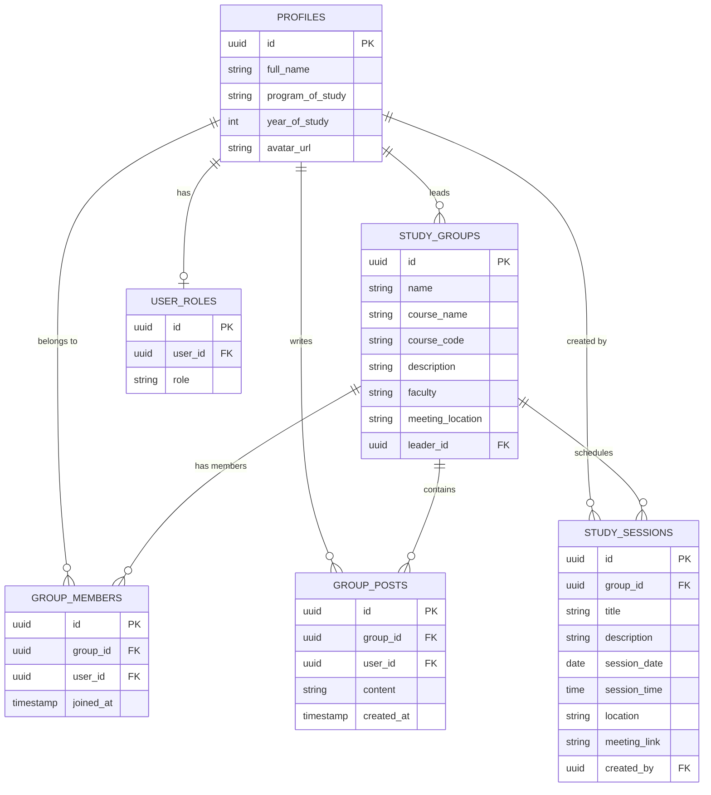

# FACULTY OF ENGINEERING, DESIGN AND TECHNOLOGY
## DEPARTMENT OF COMPUTING AND TECHNOLOGY
### COURSE CODE: CSC1202 | COURSE NAME: WEB AND MOBILE APPLICATION DEVELOPMENT

**PROJECT REPORT: STUDENT STUDY GROUP FINDER**

---

## 1. Introduction
Collaborative learning is a critical aspect of tertiary education, providing students the platform to enhance their academic experiences. Currently, finding and organizing study groups at Uganda Christian University largely depends on informal personal networks and impromptu social media interactions, often limiting broader participation.

The **Student Study Group Finder** aims to directly address this limitation. It provides a structured, digital platform where students can create, discover, and actively manage academic study groups. This ensures a centralized, accessible, and inclusive environment, promoting academic excellence and collaborative learning across all university faculties.

---

## 2. Problem Statement & Objectives
### Problem Statement
The challenge students face is the fragmented and isolated nature of forming academic alliances. Without a centralized hub, students missing initial social connections struggle to find study groups tailored to their specific courses, minimizing equal learning opportunities.

### Objectives
1. To implement secure user authentication and student profile management.
2. To provide functionalities for the creation, management, and discovery of study groups based on courses and faculties.
3. To enable group leaders to schedule and organize study sessions seamlessly.
4. To implement group communication tools (posts/announcements) for collaborative preparation.

---

## 3. Technology Stack & Choices
In line with fulfilling the requirement of a scalable and robust minimal viable product (MVP), the following stack was used:
- **Frontend Framework**: React.js configured with Vite. Selected for fast rendering, component reusability, and efficient state management.
- **Styling**: Tailwind CSS & Radix UI. Chosen for utility-first styling and accessible UI components ensuring a responsive design.
- **Backend Framework / Database**: Supabase (PostgreSQL with PostgREST). Chosen for out-of-the-box secure JWT authentication, real-time database capabilities, and relational data structures.
- **Hosting / Deployment**: GitHub Pages (Frontend) & Supabase Cloud (Backend/Database).

---

## 4. System Architecture
The application follows a Client-Server architecture utilizing a Backend-as-a-Service (BaaS) model.

```mermaid
flowchart TD
    User([Student/Admin]) -->|HTTPS| Frontend(React/Vite Frontend)
    Frontend -->|JWT Auth| SupabaseAuth(Supabase Authentication)
    Frontend -->|REST API calls| SupabaseAPI(Supabase PostgREST API)
    SupabaseAPI -->|SQL queries| PostgreSQL[(PostgreSQL Database)]
    SupabaseAuth --> PostgreSQL
    
    subgraph Frontend Subsystem
    ReactComponents[React Components]
    ReactQuery[React Query - State Mgt]
    Tailwind[Tailwind CSS Styling]
    ReactComponents --> ReactQuery
    ReactComponents --> Tailwind
    end

    Frontend --- Frontend Subsystem
    
    subgraph Backend Subsystem
    SupabaseAuth
    SupabaseAPI
    PostgreSQL
    end
```

---

## 5. Entity Relationship (ER) Diagram
The database strictly adheres to a normalized relational structure. 



---

## 6. End-User Manual
### 6.1 Registration and Authentication
- **Step 1**: Navigate to the platform's homepage.
- **Step 2**: Click on **Sign Up**. Input your full name, program of study, year of study, email, and a secure password.
- **Step 3**: Verify your account and securely log in to access the Dashboard.

### 6.2 Managing Study Groups
- **Finding a Group**: In the "Discover Groups" tab, use the search filters to search by course name, code, or faculty.
- **Creating a Group**: Navigate to the "Create Group" section. Provide the Group Name, Course Details, and Meeting Strategy. *You are immediately assigned as the Group Leader.*
- **Joining a Group**: Select your desired group from the repository and click "Join". 

### 6.3 Scheduling and Communication
- **Scheduling Sessions (Leaders Only)**: Inside your group manager view, select "New Session". Provide the Date, Time, Description, and the Location/Link. All members will see this in their Dashboard.
- **Communication (All Members)**: In the Group Hub, use the discussion board to drop short posts, questions, and announcements for fellow group members. 

---

## 7. API Documentation

Our platform utilizes RESTful endpoints generated dynamically via Supabase. Below are core API routes implemented:

### Authentication Endpoints
- **`POST /auth/v1/signup`**
  - **Description**: Registers a new student.
  - **Payload**: `{ email, password, metadata: { full_name, program } }`

- **`POST /auth/v1/token?grant_type=password`**
  - **Description**: Authenticates a user and returns a Session JWT.

### Study Group Endpoints
- **`GET /rest/v1/study_groups`**
  - **Description**: Retrieves study groups. Supports query filters like `?course_code=eq.CSC1202`.
- **`POST /rest/v1/study_groups`**
  - **Description**: Creates a new group. Requires valid JWT with Group Leader parameters.

### Study Sessions Endpoints
- **`GET /rest/v1/study_sessions?group_id={id}`**
  - **Description**: Fetches all upcoming sessions for a specific group.
- **`POST /rest/v1/study_sessions`**
  - **Description**: Schedules a study meeting. Payload must include date, time, and location/link.

---

## 8. GitHub Repositories Link
- **Frontend / Integrations Repository**: [GitHub Application Setup](https://github.com/evarduwamani-ctrl/Student-Study-Group-Finder)
- **Backend Environment**: Implemented transparently using Supabase PostgREST BaaS logic embedded directly alongside the application build workflow.

---

## 9. References
[1] D. Flanagan, *JavaScript: The Definitive Guide*, 7th ed. Sebastopol, CA: O'Reilly Media, 2020.
[2] "Supabase Official Documentation," Supabase. [Online]. Available: https://supabase.com/docs. [Accessed: April 2026].
[3] "React – A JavaScript library for building user interfaces," React. [Online]. Available: https://reactjs.org/. [Accessed: April 2026].
[4] "Tailwind CSS - Rapidly build modern websites without ever leaving your HTML," Tailwind Labs. [Online]. Available: https://tailwindcss.com/. [Accessed: April 2026].
[5] "IEEE Reference Guide," IEEE, Piscataway, NJ, USA, 2018.

